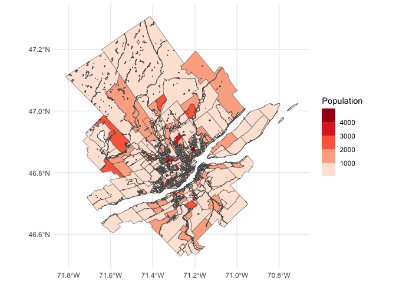

<!-- README.md is generated from README.Rmd. Please edit that file -->

# canaccessR

<!-- badges: start -->
<!-- badges: end -->

Package {canaccessR} is an [Open Data Product](https://rdcu.be/dY1Ic)
with travel time tables to employment and groceries in selected Canadian
Metropolitan Areas.

The package was initially developed for a writing project commissioned
by the [School of Cities](https://schoolofcities.utoronto.ca) of the
University of Toronto, and can be used to replicate the results reported
in the paper.

## Installation

You can install the development version of canaccessR like so:

``` r
# install.packages("remotes")
remotes::install_github("paezha/canaccessR")
```

## Example

This is a basic example which shows you how to solve a common problem:

``` r
library(canaccessR)
library(ggplot2)
library(sf)
#> Linking to GEOS 3.11.0, GDAL 3.5.3, PROJ 9.1.0; sf_use_s2() is TRUE
```

Load the travel time table to employment for Halifax:

``` r
data(travel_matrix_emp_hal)
```

The median travel time in minutes from all origins to all destinations
in Halifax is:

``` r
median(travel_matrix_emp_hal$travel_time_p50)
#> [1] 65
```

Simple features objects for cartography are also included. For example,
this is Quebec:

``` r
data("census_data_da_que")
```

Plot the population by Dissemination Area:

``` r
ggplot() +
  geom_sf(data = census_data_da_que,
          aes(fill = Population)) +
  scale_fill_fermenter(palette = "Reds",
                       direction = 1) +
  theme_minimal()
```



We are currently working on a Data Paper.
