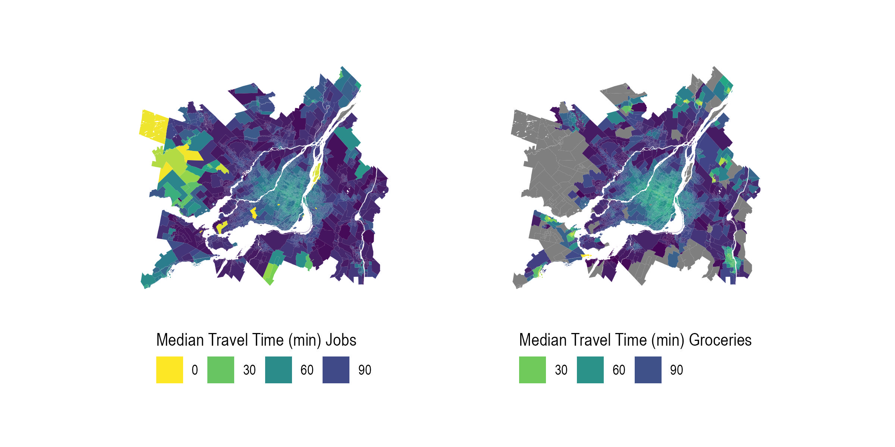

```{r knitr-setup, include=FALSE}
knitr::opts_chunk$set(
  echo = FALSE,
  cache = FALSE,
  warning = FALSE,
  comment = '', 
  out.width = "1\\linewidth")

knitr::knit_hooks$set(inline = function(x) {
  if (is.numeric(x)) {
    format(x, big.mark = ",", scientific = FALSE)
  } else {
    x
  }
})

opts <- options(knitr.kable.NA = "")
```

```{r install-data-package, include=FALSE}
if (!require("canaccessR", character.only = TRUE)) {
      remotes::install_github("paezha/canaccessR",
                        build_vignettes = TRUE)
}

rm(list=ls())
```

```{r load-packages, include=FALSE, cache=FALSE}
# Load packages
library(tidyverse)
library(data.table)
# library(summarytools)
library(gt)
library(gtsummary)
# library(sf)
# library(tmap)
# library(tmaptools)
```

```{r load-data, include = FALSE}
load("sk_full.Rdata")
```

# Introduction

The objective of this paper is to describe the {canaccessR} open data package. Its main contents are a set of public transit travel time matrices (TTM) estimates to employment and groceries stores from the 12 largest Canadian metropolitan areas in 2019 and 2023, representing approximately 55% of the Canadian population. The results are provided at the Dissemination Areas (DA) [^1] level, yielding origin-destination pairs containing associated travel time by public transit, population, total employment, mode share, and other relevant census variables and spatial shape boundaries for each metropolitan area. This data package was created by leveraging expertise in data science, R programming, and transportation analysis. It includes .Rmd notebooks written for computing travel time matrices for large sets of origin-destination pairs using the {r5r} R package [@pereiraR5rRapidRealistic2021]. Overall, {canaccessR} offers `r data(package = "canaccessR")$results[, "Item"] |> length()` complementary objects ready for temporal and spatial analysis. The package is an analysis-read product based on a fusion of data sources, including public transit schedules (GTFS files), road and transit networks, census data, and filtered business location data.

[^1]: Dissemination Areas are the smallest publicly available spatial unit provided by Statistics Canada [@governmentofcanadaDictionaryCensusPopulation2021a].

TTMs are a core piece of information required for estimating spatial interaction. Accessibility -the _potential_ spatial interaction offered by the transportation system to reach destinations [@paezMeasuringAccessibilityPositive2012]- is an example of a measure that requires TTMs. Recent efforts following an open-source and transparent philosophy have been made to disseminate useful data and information on transportation in the Canadian context [@soukhovTTS2016RDataSet2023]. However, despite these initiatives, pre-processed and available data that allow for the ease estimation of accessibility indicators are still scarce. Within this context, we expect to help filling this gap by the processing raw into user-ready data and making them publicly available to advance knowledge on the field. Our main contribution is to provide analysis-ready data for Canada's largest cities on the topic of transportation accessibility, thus making urban analytics in the country more accessible and contributing to future research and data-driven decision making.

The package's main audiences are Canadian researchers in urban planning and transportation and transportation system agencies. We anticipate three primary uses for the open data product (ODP) described in this paper. First, the datasets allow for static assessment of the level of public transit accessibility across the country's largest cities before and after the COVID-19 pandemic. In other words, {canaccessR} makes it easier for those interested in comparing cities regarding their level of public transit accessibility to essential destinations (such as employment centers and groceries stores) to do so. Second, the temporal and spatial characters of the datasets made available here allow researchers to evaluate accessibility changes through time and across space within the largest Canadian urban areas. Third, as is now common practice in transportation accessibility research, used as inputs, these estimates can substantiate broader investigations on transportation justice and equity [@higginsChangesAccessibilityEmergency2021; @humbertoHowTranslateJustice2023; @pereiraGeographicAccessCOVID192021]. For example, the TTM estimates allow for evaluating the evolution of public transit's accessibility by income or spatial distribution across all Dissemination Areas (DA's) of each of the 12 cities in the sample [@pargaDemocraticAccessOur2024]. In other words, the package's contents can be used from straightforward assessments of accessibility in Canadian urban areas to more theoretically and morally complex evaluations of justice in the country's urban transportation system.

Besides this introduction, we organize this paper as follows. The next section contains a description of the data sources we used to construct the data package. Then, we recount the data processing necessary to create the package. Next, we go through the main contents of the data package, i.e., the travel time matrices estimated through our analysis. We present some basic descriptive statistics of these datasets, and elucidate how one can use them in accessibility analysis. Finally, we conclude by explaining how we expect {canaccessR} to contribute to the urban analytics and science community.


# Data and methods

## Raw data sources

The locations included in the data package comprise the 12 largest (population-wise) Census metropolitan areas (CMA's) based on the 2016 Canadian Census [@governmentofcanada2016CensusPopulation2016] [^2].These locations are the surrunding Toronto, Montreal, Vancouver, Ottawa-Gatineau, Calgary, Edmonton, Quebec City, Winnipeg, Hamilton, Kitchener-Cambridge-Waterloo, London, and Halifax areas. We used four main data sources to construct the {canaccessR} data package: General Transit Feed Specification (GTFS), OpenStreetMap (OSM), DMTI’s Enhanced Points of Interest, and Statistics Canada Census data.

[^2]: We included Oshawa as part of the Greater Toronto Area (GTA) because of its proximity. Similarly, we included Abbotsford-Mission as part of the Vancouver metropolitan area due to its proximity to a transit station on the region’s West Coast Express commuter rail line.

<!-- ## General Transit Feed Specification -->
We manually collected and processed the GTFS files from all transit agencies within the selected CMA's to use their information on the public transit schedule in 2019 and 2023.
<!-- ## OpenStreetMaps -->
The OpenStreetMap data for the selected areas were collected through the {osmextract} package [@gilardiOsmextractDownloadImport2025].
We used OSM data from 2019 and 2023, which provided information on the areas' transit network in two points in time.
<!-- ## Census Data -->
We collected data from the 2016 Canadian Census using the {cancensus} package [@vonbergmannCancensusPackageAccess2022] and used its information on the spatial distribution of the population and the number of workplace locations (employment) across the CMA's [@governmentofcanada2016CensusPopulation2016].
<!-- ## DMTI’s Enhanced Points of Interest -->
Finally, we gathered and cleaned the 2023 DMTI’s Enhanced Points of Interest dataset to obtain the location of the groceries stores within every urban area selected [@dmtispatialincEnhancedPointsInterest2015]. We filtered the locations within the DMTI dataset using the grocery stores code from the North American Industry Classification System (NAICS) and the Standard Industrial Classification (SIC).
<!-- {**THE CODE FOR THIS ESTIMATIONS AND THE TRAVEL TIME MATRICES IS ON THE transit_death_spiral github repo. 1) SHOULD WE CITE IT? 2) IS THAT A PROBLEM?**} -->

## Methods: travel time matrices processing

Using the {r5r} R package, we estimated public transit travel times for two destination types, grocery stores and jobs.  For each amenity type, we chose a likely travel time and day of the week. We set a 15 minutes time window and the maximum trip duration to 120 minutes. The estimated times are the median of the 15 minute time window. For groceries stores, we set the departure date to a weekend afternoon and the departure time to between 12:00 PM to 12:15 PM on April 20, 2019 and April 22, 2023. For employment, we ran the analysis on a typical weekday morning rush-hour commute, more specifically 8:00 to 8:15 AM departure on Tuesday, April 16, 2019 and Tuesday, April 18, 2023 [^3]. In both cases, we assumed that walking was the mode of travel from origin to transit stop and from transit stop to destination. We aggregated all the resulting travel time matrices at the DA level, which comprise the fundamental spatial unit of analysis in data package.

[^3]: The one exception is Quebec City, where the routing for 2019 occurs on a Saturday and Tuesday in June (instead of April) due to the GTFS data unavailability.

# {canaccessR}'s contents

<!-- ## Travel time matrices -->
Specifically, the package contains the following contents: `r grep(paste("^", "travel_matrix_grc_", sep=""), data(package = "canaccessR")$results[, "Item"]) |> length()` *data.frame* objects containing the calculated public travel times from DA centroids to grocery stores and another `r grep(paste("^", "travel_matrix_emp_", sep=""), data(package = "canaccessR")$results[, "Item"]) |> length()` for DA centroids to DA centroids. Notably, the {travel_matrix_grc_ggh} *data.frame* is named after the acronym for the Greater Golden Horseshoe area, which includes the CMA regions of Toronto, Hamilton, and Kitchener-Cambridge-Waterloo. The `r grep(paste("^", "travel_matrix_", sep=""), data(package = "canaccessR")$results[, "Item"]) |> length()` travel time *data.frame*s represent public transit travel times for all 12 CMAs across two sets of destinations. Next, `r grep(paste("^", "census_data_da_", sep=""), data(package = "canaccessR")$results[, "Item"]) |> length()` *sf* objects represent census data for each DA, including dwelling counts, population by age bracket, single-parent-headed households, low-income prevalence, official language knowledge, housing- quality, ownership and affordability variables, visible minority, newcomer- and immigration- related variables, educational attainment, and commuting mode shares. Furthermore, `r grep(paste("^", "census_data_cma_", sep=""), data(package = "canaccessR")$results[, "Item"]) |> length()` and `r grep(paste("^", "region_background_", sep=""), data(package = "canaccessR")$results[, "Item"]) |> length()` *sf* objects represent the CMA areas' boundaries and backgrounds for plotting the data spatially, respectively. Finally, `r grep("statistics", data(package = "canaccessR")$results[, "Item"]) |> length()` *data.frame*s contain aggregated population and transit statistics at the CMA level.

<!--AS: Joao, I rephrased the below into one paragraph, what do you think?  -->

<!-- The main contents of the {canaccessR} package are the travel time matrices. -->
<!-- <!-- These matrices are data frames with origin-destination pairs, travel time by public transit, and population and employment by Census Dissemination Area.  --> 
<!-- These matrices (datasets) comprise the estimated travel time by transit from and to each origin and destination Dissemination Area pairs. The datasets also feature the total population in the origin DA and the total employment in the destination DA. Besides these information, the matrices contain the unique origin and destination DA codes, region and name identifiers, the year in which the travel times refers to, and the date and time of departure for a trip that originates at the Dissemination Area of origin. There are two matrices for each metropolitan area, one containing the travel times to jobs and the other to groceries stores [^4]. These information can be turned into spatial data using the socio-economic and demographic datasets. -->

<!-- [^4]: The information from Toronto, Hamilton, and Waterloo are aggregated at the Greater Golden Horseshoe travel time matrices, making it 20 datasets in total.  -->


<!-- The socio-economic and demographic data contain other information disaggregated at the DA level for each CMA.  -->
<!-- These refer to total population by age groups, number of dwellings, number of individuals below the Low Income Measure, etc. -->
<!-- The aggregated statistics refer to population aggregates (for the selected CMA's) and transit revenue and ridership data aggregated by regional and national scale. -->

We now present some descriptive statistics from the travel time matrices contained in the {canaccessR} package. Table @tbl-table_1 summarizes the travel time estimates. The travel time objects contain, in total, 97,784,850 origin-destination pairs (observations) from population to employment locations for all the DA's in the sample and 18,519,897 pairs from population to groceries stores. Considering all areas combined, the mean travel time to jobs was 78 and 76 to groceries stores.

```{r, fig.pos="H"}
#| label: tbl-table_1
#| tbl-cap: "Descriptive statistics of the travel time matrices from the {canaccessR} package."
#| echo: false
#| message: false


sk_full %>% 
  gt() %>% 
  fmt_number(use_seps = TRUE, decimals = FALSE) |>  
  tab_options( 
    table.font.size = 10,
    table.width = pct(100) 
    )  

```


<!--
# Python integration

Possibly provide a Jupyter Notebook containing a Python script to demonstrate how to read R data files (.rda) and convert them into Pandas DataFrames.

-->

# {canaccessR} usage

This section presents an usage example of the package through visual representation of its data. In Figure @fig-travel_time_emp_grc_plot, we show the spatial distribution of the travel time matrices for the metropolitan region of Montréal. In it, we see the median travel time from each DA to employment (left) and to groceries stores (right). The plot shows that moving away from the city core increases the necessary travel time by public transit to reach employment locations and groceries stores. 


```{r, fig.pos="H"}
#| label: fig-travel_time_emp_grc_plot
#| fig-cap: "Estimated median travel time (minutes) per Dissemination Area to jobs (left) and groceries stores (right). Public transit travel times are calculated using {r5r} (Pereira et al., 2021), and DA and planning boundaries of the Montréal metropolitan area use Statistics Canada data (Statistics Canada, 2016)."
#| out-width: 100%
#| echo: false

```
<!--AS: Where is the 0-30 bin for grocery stores? It would be helpful to change the plot so it reads '0-30' '30-60', '60-90', 90-120min -->

A more thorough example of the package's use can be found on the School of Cities' recent report on Canada's Urban Infrastructure Deficit. In its 11th Chapter, we use the travel time matrices to estimate accessibility metrics to jobs and groceries stores before and after the pandemic [@pargaDemocraticAccessOur2024]. We then compare how changes affected groups differently according to their spatial distribution and income level, thus making explicit the connection of the package's information and matters of equity in transportation. The report is freely available for download at the State of Cities Summit [website](https://stateofcitiessummit.ca/report).

# Concluding remarks

In this paper, we describe the {canaccessR} data package, created using the {r5r} package and transit schedule, street network, employment, and population data. The package's main contents refers to the ready-to-use travel time matrices for public transit to reach employment and groceries stores in Canada's 12 largest urban areas. We expect the contents of the package to be used in transportation accessibility evaluations within and across those regions. Moreover, these datasets can be used in further equity assessments that evaluate the distribution of accessibility across space and between social groups. Furthermore, in the spirit of open data products [@arribas-belOpenDataProductsA2021], the package can be expanded through collaboration with other researchers by, for example, including travel time matrices to other essential destinations within the DMTI's dataset (*e.g.*, schools, healthcare, etc.). In other words, we hope that by making these datasets publicly available, future analysis can contribute to making Canada's transportation system more just and fair, considering accessibility's as the main social good of transportation [@martensTransportJusticeDesigning2016], and the inherent connection between public transit and the "right to the city" [@cogginRightTransportMoving2015].


<!-- In conclusion, we argue that the {canaccessR} package adds  -->

<!-- In this sense, the package fulfill one of the main tenets of ODPs products by combining expertise in data science, transportation accessibility, and demographics and generating a set of useful and ready-to-use data vital to estimating transportation accessibility, rather than simply making raw data available. -->
<!-- In other words, the travel time matrics presented by this  -->


<!-- value to the urban analytics and science community by  -->

<!-- We expect the package to have two main contribu -->
<!-- The main contribution from the {canaccessR} package is the  -->

<!-- Finally, we expect that this data package can substantiate accessibility analysis across Canada. -->


# Declaration of Conflicting Interests

The author(s) declared no potential conflicts of interest with respect to the research, authorship, and/or publication of this article.

# Funding

The author(s) disclosed receipt of the following financial support for the research, authorship, and/or publication of this article: This work was supported by the Social Sciences and Humanities Research Council of Canada (*More description about the funding source after the review process*).

# ORCID

  - name: João Pedro Figueira Amorim Parga
    orcid: 0000-0002-4105-5927
  - name: Anastasia Soukhov
    orcid: 0000-0003-4371-4831
  - name: Robert Nutifafa Arku
    orcid: 0000-0002-2018-886X
  - name: Christopher Higgins
    orcid: 0000-0002-3551-7750
  - name: Antonio Páez
    orcid: 0000-0001-6912-9919


# Data availability statement

The {canaccessR} data package can be found and installed on its Github [respository](https://github.com/paezha/canaccessR).

# References {#references .unnumbered}
